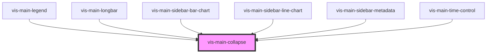

# vis-main-collapse

<!-- Auto Generated Below -->

## Properties

| Property    | Attribute   | Description | Type      | Default     |
| ----------- | ----------- | ----------- | --------- | ----------- |
| `collapsed` | `collapsed` |             | `boolean` | `undefined` |

## Shadow Parts

| Part        | Description |
| ----------- | ----------- |
| `"content"` |             |
| `"header"`  |             |

## Dependencies

### Used by

 - [vis-main-legend](../vis-main-legend)
 - [vis-main-longbar](../vis-main-longbar)
 - [vis-main-sidebar-bar-chart](../vis-main-sidebar-bar-chart)
 - [vis-main-sidebar-line-chart](../vis-main-sidebar-line-chart)
 - [vis-main-sidebar-metadata](../vis-main-sidebar-metadata)
 - [vis-main-time-control](../vis-main-time-control)

### Graph

----------------------------------------------

*Built with [StencilJS](https://stenciljs.com/)*
