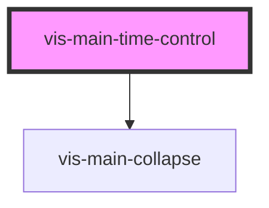

# vis-main-time-control

<!-- Auto Generated Below -->

## Properties

| Property | Attribute | Description | Type              | Default     |
| -------- | --------- | ----------- | ----------------- | ----------- |
| `data`   | --        |             | `TimeControlData` | `undefined` |

## Dependencies

### Depends on

- [vis-main-collapse](../vis-main-collapse)

### Graph

----------------------------------------------

*Built with [StencilJS](https://stenciljs.com/)*
